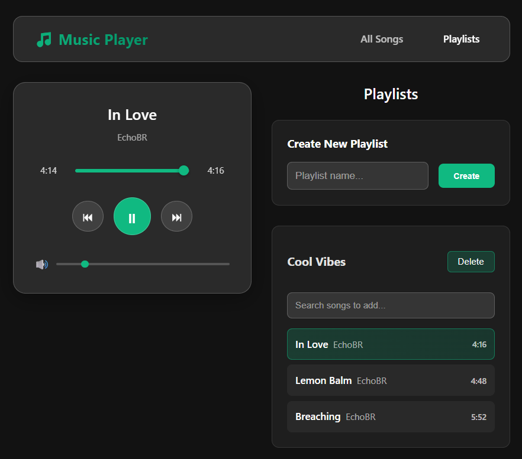

# Music Player

React JS + Vite app from the youtube video :

- [Yt Pedrotech channel](https://www.youtube.com/@PedroTechnologies)
- [Build 3 React Projects in 4 Hours | ReactJS Course For Beginners](https://www.youtube.com/watch?v=r47C9c4qCqE)

Obs: This is the second app

## Topics

<ul>
<li>Hooks (useState,useEffect)
<li>Custom contexts (MainContext)
<li>Components
<li>Context
<li>LocalStorage
<li>Web Audio API (browser)
</ul>
